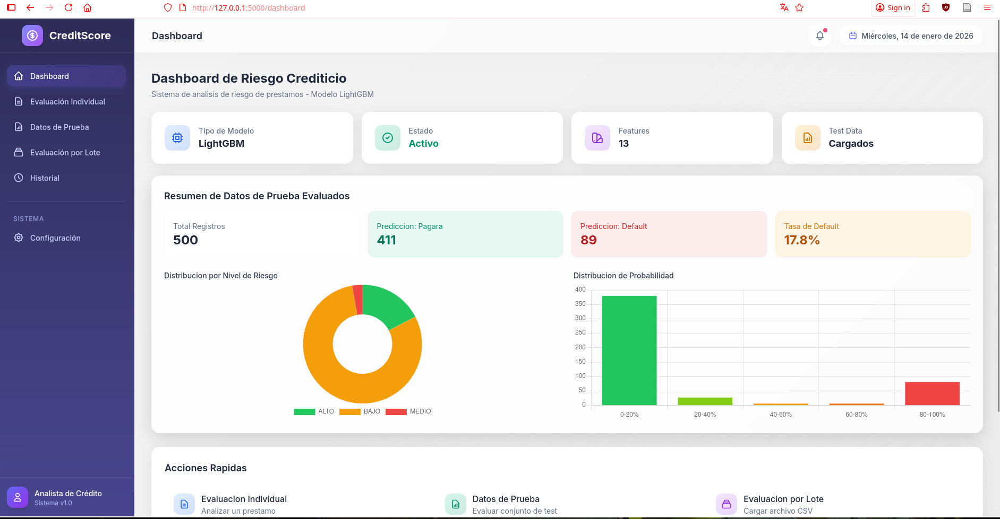
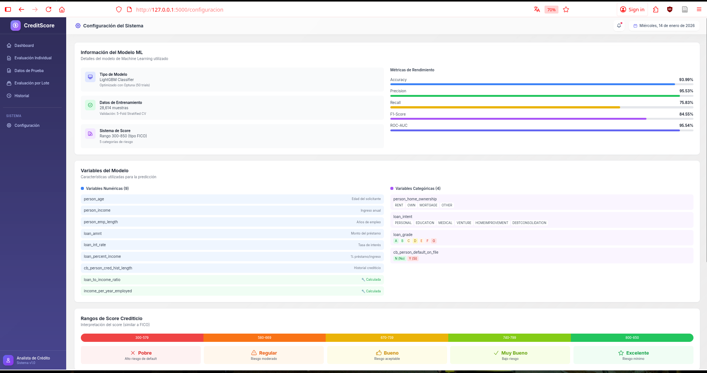
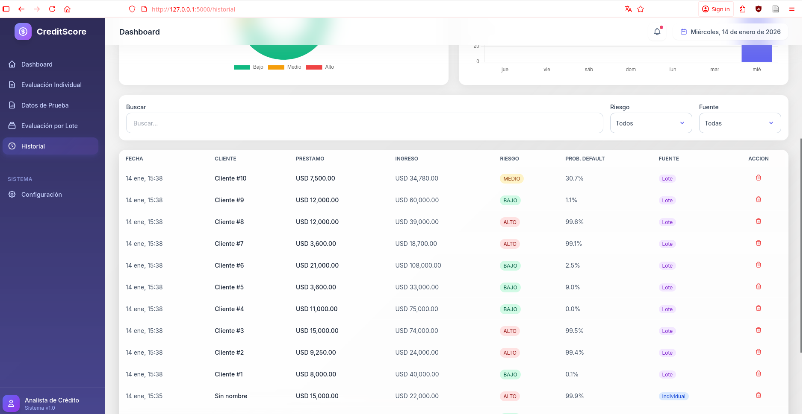

# 🏦 Sistema de Evaluación Crediticia – Aplicación Web con Machine Learning

Sistema web profesional para la **evaluación de riesgo crediticio** utilizando modelos de _Machine Learning_, con interfaz interactiva y soporte para evaluaciones individuales y por lote.

---

## 👤 Autor

- **Nombre:** Jorge Guillermo Olarte Quispe
- **Universidad:** Universidad Nacional del Altiplano

## 🚀 Funcionalidades Principales

### 📊 Dashboard y Métricas

| Dashboard                                 | Métricas                                |
| ----------------------------------------- | --------------------------------------- |
|  |  |

---

### 👤 Evaluación Individual de Riesgo

| Bajo Riesgo                                                  | Alto Riesgo                                                  |
| ------------------------------------------------------------ | ------------------------------------------------------------ |
|  |  |

- Score crediticio (300 – 850)
- Probabilidad de default
- Recomendaciones automáticas

---

### 🧮 Modal de Resultado

| Riesgo Bajo                                           | Riesgo Alto                                           |
| ----------------------------------------------------- | ----------------------------------------------------- |
|  |  |

---

### 📂 Evaluación por Lote (Batch Processing)

| Carga y Evaluación                                                |
| ----------------------------------------------------------------- |
|  |

- Procesamiento masivo desde CSV
- Descarga de resultados
- Manejo de errores

---

### 🕒 Historial de Evaluaciones

| Historial                                 |
| ----------------------------------------- |
|  |

---

## 📋 Requisitos

- Python 3.8+
- Flask
- pandas
- scikit-learn
- lightgbm
- joblib

## 🔧 Instalación

```bash
# Navegar al directorio web
cd crediticio/web

# Crear entorno virtual (opcional)
python -m venv venv
source venv/bin/activate  # Linux/Mac
# o: venv\Scripts\activate  # Windows

# Instalar dependencias
pip install -r requirements.txt
```

## ▶️ Ejecución

```bash
# Desde el directorio web
python app.py

# O con Flask directamente
flask run --debug
```

Abrir en el navegador: http://localhost:5000

## 📁 Estructura del Proyecto

```
web/
├── app.py                 # Aplicación Flask principal
├── requirements.txt       # Dependencias
├── README.md             # Esta documentación
├── uploads/              # Archivos temporales
└── templates/
    ├── base.html         # Template base
    ├── dashboard.html    # Dashboard principal
    ├── evaluacion.html   # Evaluación individual
    ├── lote.html         # Evaluación por lote
    ├── historial.html    # Historial de evaluaciones
    ├── configuracion.html # Configuración del sistema
    └── errors/
        ├── 404.html
        └── 500.html
```

## 🔌 API Endpoints

### Evaluación Individual

```
POST /api/evaluar
Content-Type: application/json

{
  "person_age": 35,
  "person_income": 60000,
  "person_home_ownership": "RENT",
  "person_emp_length": 5,
  "loan_intent": "PERSONAL",
  "loan_grade": "B",
  "loan_amnt": 15000,
  "loan_int_rate": 11.5,
  "loan_percent_income": 0.25,
  "cb_person_default_on_file": "N",
  "cb_person_cred_hist_length": 4
}
```

### Evaluación por Lote

```
POST /api/evaluar-lote
Content-Type: multipart/form-data
file: archivo.csv
```

### Dashboard Data

```
GET /api/dashboard-data
```

### Modelo Info

```
GET /api/modelo-info
```

## 🎨 Tecnologías

- **Backend**: Flask (Python)
- **Frontend**: HTML5, Tailwind CSS
- **Gráficos**: Chart.js
- **ML**: LightGBM, scikit-learn

## 📊 Métricas del Modelo

| Métrica   | Valor  |
| --------- | ------ |
| Accuracy  | 93.99% |
| Precision | 95.53% |
| Recall    | 75.83% |
| F1-Score  | 84.55% |
| ROC-AUC   | 95.54% |

## 📄 Licencia

Este proyecto es parte del sistema de evaluación crediticia desarrollado con fines educativos y de demostración.
